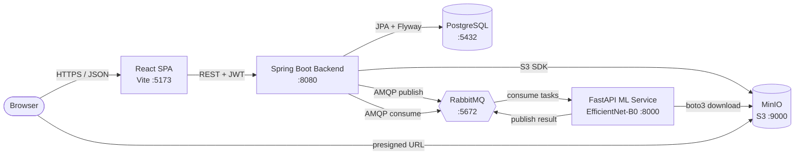
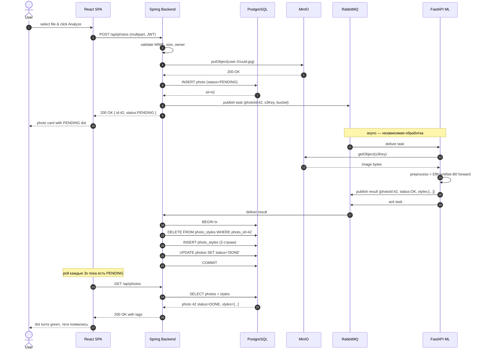
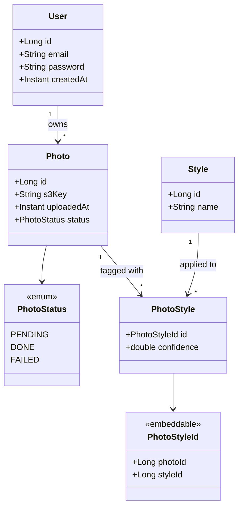
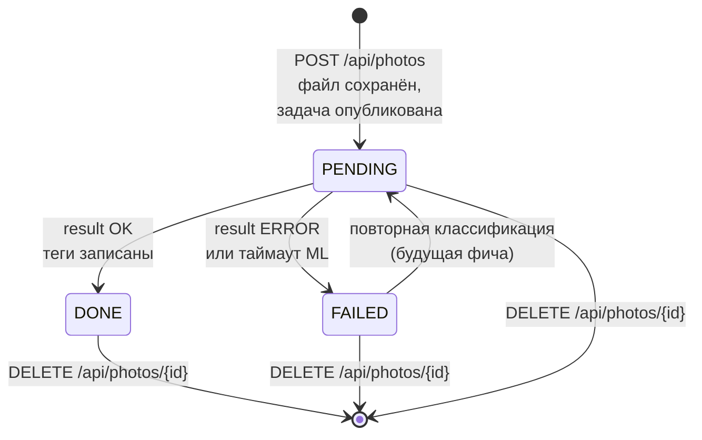
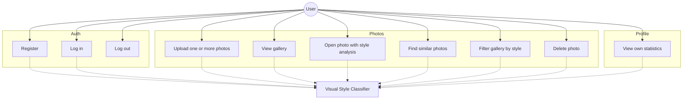
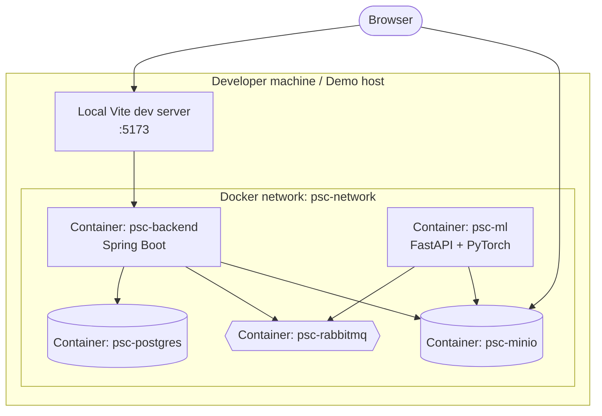

# UML-диаграммы

GitHub нативно рендерит Mermaid-блоки. Эти диаграммы используются как иллюстрации в дипломном отчёте (`docs/REPORT.md`, главы 2 и 3) и как самостоятельный материал для защиты.

---

## 1. Component diagram

Развёртывание системы и связи между компонентами.

---

## 2. Sequence diagram — загрузка и классификация фотографии

Полный сценарий от клика "Upload" до отображения тегов в галерее.

---

## 3. Class diagram — модель домена

Сущности JPA и их связи.

---

## 4. State diagram — жизненный цикл фотографии

---

## 5. Use case diagram

---

## 6. Deployment diagram

